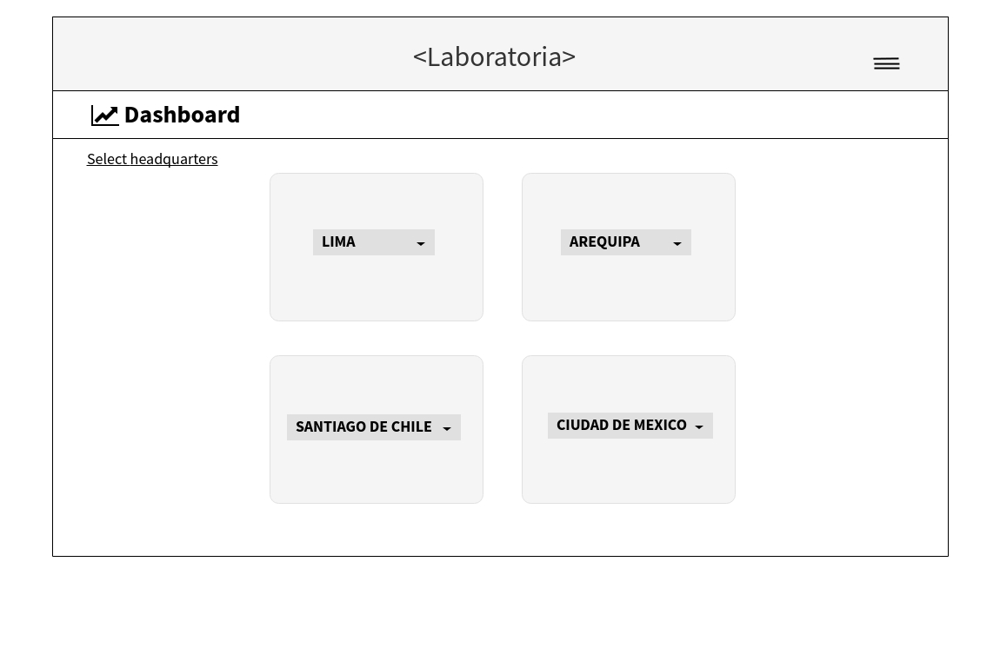
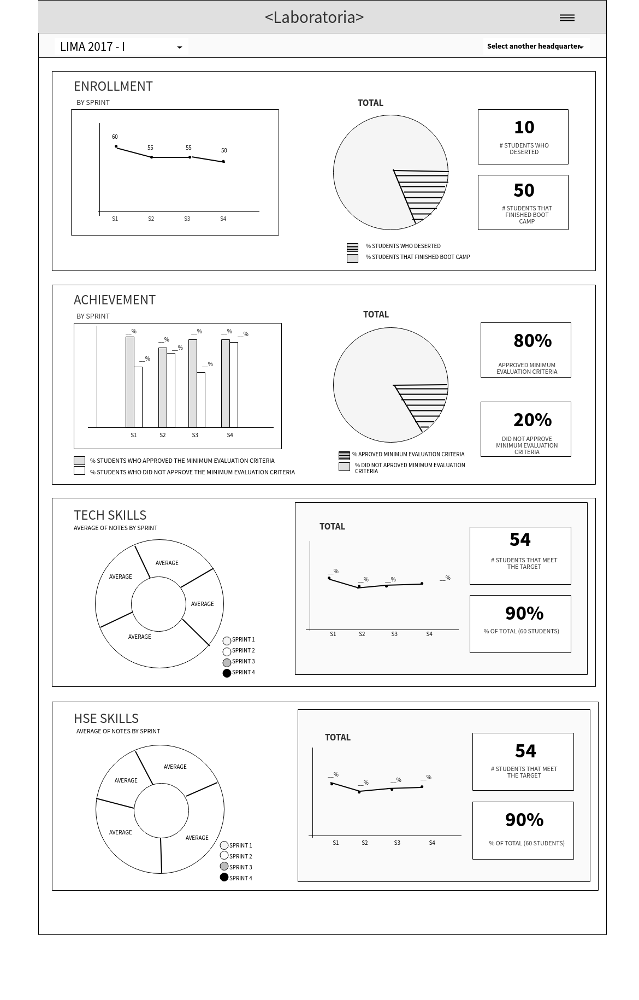

# Dashboard - Laboratoria

## Objetivo

Elaborar un sketch del dashboard de Laboratoria.

## Descripción

El dashboard es una herramienta utilizada por profesores, training managers, directores y gerentes de Laboratoria para ver rápidamente qué está pasando en el salón de clases de Laboratoria. En el dashboard, los usuarios mencionados pueden ver rápidamente estadísticas y datos en tiempo real como:

* número de alumnas inscritas.
* númerode alumnas que desertaron.
* porcentaje de alumnas que pasan el criterio mínimo de evaluación.
* promedio de notas por sprint.
* promedio de notas HSE.
* promedio de notas técnicas.

Además, dado que Laboratoria tiene muchas generaciones, regularmente 2 generaciones por año (estas generaciones empezaron en el 2014), y que opera en 4 sedes (Arequipa, Ciudad de México, Lima y Santiago de Chile), es posible que los usuarios quieran ver datos de sedes / generaciones anteriores para poder hacer comparaciones.

## Consideraciones

* Tener en cuenta los elementos de navegación en los sketches.
* Utilizar títulos y textos reales.

## Resolución

Para el desarrollo del sketch del dashboard de Laboratoria, he implementado dos páginas. La primera me da la opción de elegir entre las sedes de la Laboratoria y el período.

En la segunda página:

* Se mostrarán los datos y gráficos estadísticos de la sede y período escogido en la página anterior.
* También estará habilitada la opción que permite cambiar el período de la sede escogida. 
* Asimismo se ha adicionado un menú desplegable que permitirá escoger otra sede. Por default, al escoger una nueva sede desde esta segunda página, se direccionará al último período que se esté cursando en ella.

